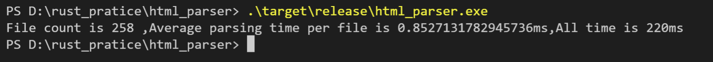

# SIMPLE HTML PARSER USE Rust

## 使用Rust写的简单HTML解析器

## 代码仅供参考，初次写的比较垃圾

## 其他语言

- [JavaScript](https://github.com/liulinboyi/simple-htmlparser)

### Benchmark对比在[dev分支](https://github.com/liulinboyi/rust-simple-htmlparser/tree/dev)

## htmlparser-benchmark

https://github.com/AndreasMadsen/htmlparser-benchmark

```
File count is 258 ,Average parsing time per file is 0.8527131782945736ms,All time is 220ms
```


```


<!DOCTYPE html>
<html lang="en">
<head>
    <meta charset="UTF-8">
    <meta http-equiv="X-UA-Compatible" content="IE=edge">
    <meta name="viewport" content="width=device-width, initial-scale=1.0">
    <title>Document</title>
</head>
<body>
    <!--  -->
    
</body>
</html>


```

```
{
    "type": "root",
    "content": null,
    "index": 0,
    "tag": null,
    "children": [
        {
            "type": "text",
            "content": "\r\n\r\n\r\n",
            "index": 6,
            "tag": null,
            "children": [],
            "close_tag": null,
            "self_close": null,
            "attrs": null
        },
        {
            "type": "DOCTYPE",
            "content": "html",
            "index": 20,
            "tag": null,
            "children": [],
            "close_tag": null,
            "self_close": null,
            "attrs": null
        },
        {
            "type": "text",
            "content": "\r\n",
            "index": 23,
            "tag": null,
            "children": [],
            "close_tag": null,
            "self_close": null,
            "attrs": null
        },
        {
            "type": "node",
            "content": null,
            "index": 39,
            "tag": "html",
            "children": [
                {
                    "type": "text",
                    "content": "\r\n",
                    "index": 41,
                    "tag": null,
                    "children": [],
                    "close_tag": null,
                    "self_close": null,
                    "attrs": null
                },
                {
                    "type": "node",
                    "content": null,
                    "index": 47,
                    "tag": "head",
                    "children": [
                        {
                            "type": "text",
                            "content": "\r\n    ",
                            "index": 53,
                            "tag": null,
                            "children": [],
                            "close_tag": null,
                            "self_close": null,
                            "attrs": null
                        },
                        {
                            "type": "node",
                            "content": null,
                            "index": 75,
                            "tag": "meta",
                            "children": [
                                {
                                    "type": "text",
                                    "content": "\r\n    ",
                                    "index": 81,
                                    "tag": null,
                                    "children": [],
                                    "close_tag": null,
                                    "self_close": null,
                                    "attrs": null
                                },
                                {
                                    "type": "node",
                                    "content": null,
                                    "index": 134,
                                    "tag": "meta",
                                    "children": [
                                        {
                                            "type": "text",
                                            "content": "\r\n    ",
                                            "index": 140,
                                            "tag": null,
                                            "children": [],
                                            "close_tag": null,
                                            "self_close": null,
                                            "attrs": null
                                        },
                                        {
                                            "type": "node",
                                            "content": null,
                                            "index": 210,
                                            "tag": "meta",
                                            "children": [
                                                {
                                                    "type": "text",
                                                    "content": "\r\n    ",
                                                    "index": 216,
                                                    "tag": null,
                                                    "children": [],
                                                    "close_tag": null,
                                                    "self_close": null,
                                                    "attrs": null
                                                },
                                                {
                                                    "type": "node",
                                                    "content": null,
                                                    "index": 223,
                                                    "tag": "title",
                                                    "children": [
                                                        {
                                                            "type": "text",
                                                            "content": "Document",
                                                            "index": 231,
                                                            "tag": null,
                                                            "children": [],
                                                            "close_tag": null,
                                                            "self_close": null,
                                                            "attrs": null
                                                        }
                                                    ],
                                                    "close_tag": null,
                                                    "self_close": false,
                                                    "attrs": []
                                                },
                                                {
                                                    "type": "text",
                                                    "content": "\r\n",
                                                    "index": 241,
                                                    "tag": null,
                                                    "children": [],
                                                    "close_tag": null,
                                                    "self_close": null,
                                                    "attrs": null
                                                }
                                            ],
                                            "close_tag": null,
                                            "self_close": false,
                                            "attrs": [
                                                {
                                                    "key": "name",
                                                    "value": "viewport"
                                                },
                                                {
                                                    "key": "content",
                                                    "value": "width=device-width,"
                                                },
                                                {
                                                    "key": "initial-scale",
                                                    "value": "1.0"
                                                }
                                            ]
                                        },
                                        {
                                            "type": "text",
                                            "content": "\r\n",
                                            "index": 250,
                                            "tag": null,
                                            "children": [],
                                            "close_tag": null,
                                            "self_close": null,
                                            "attrs": null
                                        },
                                        {
                                            "type": "node",
                                            "content": null,
                                            "index": 256,
                                            "tag": "body",
                                            "children": [
                                                {
                                                    "type": "text",
                                                    "content": "\r\n    ",
                                                    "index": 262,
                                                    "tag": null,
                                                    "children": [],
                                                    "close_tag": null,
                                                    "self_close": null,
                                                    "attrs": null
                                                },
                                                {
                                                    "type": "comment",
                                                    "content": "  ",
                                                    "index": 271,
                                                    "tag": null,
                                                    "children": [],
                                                    "close_tag": null,
                                                    "self_close": null,
                                                    "attrs": null
                                                },
                                                {
                                                    "type": "text",
                                                    "content": "\r\n    ",
                                                    "index": 277,
                                                    "tag": null,
                                                    "children": [],
                                                    "close_tag": null,
                                                    "self_close": null,
                                                    "attrs": null
                                                },
                                                {
                                                    "type": "node",
                                                    "content": null,
                                                    "index": 286,
                                                    "tag": "img",
                                                    "children": [],
                                                    "close_tag": null,
                                                    "self_close": true,
                                                    "attrs": []
                                                },
                                                {
                                                    "type": "text",
                                                    "content": "\r\n",
                                                    "index": 289,
                                                    "tag": null,
                                                    "children": [],
                                                    "close_tag": null,
                                                    "self_close": null,
                                                    "attrs": null
                                                }
                                            ],
                                            "close_tag": null,
                                            "self_close": false,
                                            "attrs": []
                                        },
                                        {
                                            "type": "text",
                                            "content": "\r\n",
                                            "index": 298,
                                            "tag": null,
                                            "children": [],
                                            "close_tag": null,
                                            "self_close": null,
                                            "attrs": null
                                        }
                                    ],
                                    "close_tag": null,
                                    "self_close": false,
                                    "attrs": [
                                        {
                                            "key": "http-equiv",
                                            "value": "X-UA-Compatible"
                                        },
                                        {
                                            "key": "content",
                                            "value": "IE=edge"
                                        }
                                    ]
                                }
                            ],
                            "close_tag": null,
                            "self_close": false,
                            "attrs": [
                                {
                                    "key": "charset",
                                    "value": "UTF-8"
                                }
                            ]
                        }
                    ],
                    "close_tag": null,
                    "self_close": false,
                    "attrs": []
                }
            ],
            "close_tag": null,
            "self_close": false,
            "attrs": [
                {
                    "key": "lang",
                    "value": "en"
                }
            ]
        }
    ],
    "close_tag": null,
    "self_close": null,
    "attrs": null
}
```